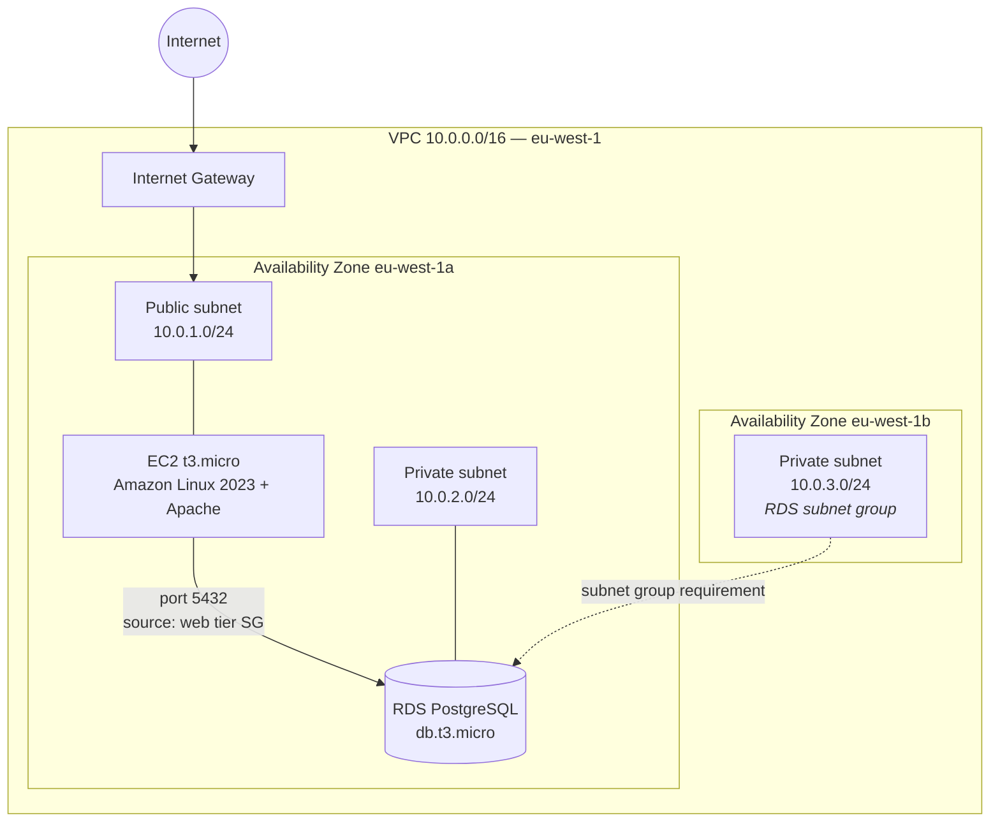

# AWS Cloud Architecture — design, deployment and post-mortem audit

A three-tier web infrastructure on AWS (networking, compute and data), deployed
in the Ireland region (`eu-west-1`) within free-tier limits.

This repository documents my final project for the Spanish Higher Vocational
Degree in Network Systems Administration (awarded highest distinction) **and the
audit I ran afterwards on my own deployment**, where I found three design flaws
I had missed while building it.

The second part is the one that matters to me. Documenting what works is easy;
finding what doesn't in your own work is the exercise that separates configuring
from designing.

---

## Contents

- [Architecture](#architecture)
- [Design decisions](#design-decisions)
- [What was actually deployed](#what-was-actually-deployed)
- [Post-mortem audit: three flaws found](#post-mortem-audit-three-flaws-found)
- [Cost incident: USD 21.96](#cost-incident-usd-2196)
- [Cost controls in place](#cost-controls-in-place)
- [Next iteration: the same architecture in Terraform](#next-iteration-the-same-architecture-in-terraform)
- [Repository structure](#repository-structure)
- [A note on methodology](#a-note-on-methodology)

---

## Architecture



**Deployed components**

| Tier | Resource | Configuration |
|---|---|---|
| Network | VPC | `10.0.0.0/16` |
| Network | Public subnet | `10.0.1.0/24` — eu-west-1a |
| Network | Private subnet | `10.0.2.0/24` — eu-west-1a |
| Network | Auxiliary private subnet | `10.0.3.0/24` — eu-west-1b |
| Network | Internet Gateway + public route table | `0.0.0.0/0` → IGW |
| Compute | EC2 `t3.micro` | Amazon Linux 2023, Apache (`httpd`) enabled at boot |
| Data | RDS PostgreSQL `db.t3.micro` | No public access, free tier |
| Security | Web tier SG | Inbound 80/TCP and 22/TCP |
| Security | Data tier SG | Inbound 5432/TCP **sourced from the web tier SG** |
| Observability | CloudWatch billing alarm + SNS | USD 1 threshold |

---

## Design decisions

Each decision with the alternative I discarded and what choosing it cost me.

### A `/16` CIDR block for the VPC

Provides 65,536 addresses, far more than this project needs. A `/24` would have
been enough.

**Why `/16`:** a VPC's CIDR block cannot be shrunk after creation, and address
space carries no charge. Over-provisioning costs nothing; running out means
rebuilding the network. In a corporate network this decision also needs to be
coordinated with on-premise addressing to avoid overlaps in a future VPN or
Direct Connect link.

### Security Group chaining instead of IP ranges

The RDS inbound rule does not point at an address or a range, but at the
**security group ID of the web tier**.

**What I gain:** any instance that joins the web security group — one launched by
an Auto Scaling Group, for example — inherits database access without touching a
single firewall rule. The permission is based on membership, not topology.

**What I lose:** no direct database access from outside, not even for me as the
administrator. Any operational work has to go through an intermediate host.
That is intentional, but it carries a real operational cost that has to be
accepted knowingly.

### Amazon Linux 2023 over Ubuntu

An AWS-maintained AMI, shipping with the SSM agent and platform tooling
preinstalled, plus long-term support. The trade-off is a smaller community and
fewer third-party packages than Ubuntu.

### `t3.micro` and the free tier as a design constraint

The project was designed with a zero budget as an explicit requirement, not as
an accident. That constraint drives decisions documented below: no NAT Gateway
and no Multi-AZ RDS, both of which fall outside the free tier.

### Same Availability Zone for the public and private subnets

Both in `eu-west-1a`, which removes inter-AZ data transfer charges.

**This is the most significant trade-off in the project, and I got it wrong.**
Saving on inter-AZ transfer is a legitimate cost argument, but it is
incompatible with high availability: if that zone goes down, the whole system
goes with it. See the audit.

---

## What was actually deployed

I separate the reference architecture from the real deployment explicitly. The
first is the target; the second is what was actually running in the account.

| Item | Designed | Deployed |
|---|---|---|
| Zone distribution | Multi-AZ | **Single zone** (`eu-west-1a`) for the whole workload |
| Load balancer | Public ALB in front of the instances | Configured, **but not operational** (see audit) |
| Scaling | Auto Scaling Group, 1–3 instances, 60% CPU threshold | Launch template and AMI created; no real traffic to validate scaling |
| Database | Multi-AZ with standby | **Single-AZ**, free tier |
| Private subnet egress | NAT Gateway | **To be confirmed** — see audit |
| Administrative access | Restricted | SSH open to `0.0.0.0/0` |

An RDS subnet group spanning two zones is an **API requirement for creating the
instance**, not a high-availability configuration. The instance still lives in a
single zone until Multi-AZ is explicitly enabled. It is an easy confusion to
fall into and worth stating plainly.

---

## Post-mortem audit: three flaws found

Rereading the project with some distance, I found three flaws. I document them
here because the value of this repository lies as much in catching them as in
the design itself.

### 1. The Application Load Balancer received no internet traffic

The ALB was created as internet-facing, but mapped to the **private** subnets
(`TFG-Subnet-Privada` in 1a and `TFG-Subnet-Privada-B` in 1b). The AWS console
raised the corresponding warning at creation time: those subnets have no route
to an Internet Gateway, so the load balancer cannot receive external requests.

**Why it is a flaw:** a public ALB needs its interfaces in subnets with a
`0.0.0.0/0` route to the IGW. The correct pattern is the inverse of what I
deployed: **load balancer in the public subnets, instances in the private ones**,
with the instances' security group accepting traffic only from the load
balancer's security group.

**Lesson:** console warnings are not noise. That warning said exactly what was
happening.

### 2. High availability was documented, not deployed

The project repeatedly claims the architecture is highly available. It was not:

- Public and private subnets both in `eu-west-1a`.
- A single EC2 instance, with no replica in another zone.
- Free-tier RDS, single-AZ.

**Why it is a flaw:** a zone failure takes the entire service down, and RDS
recovery would depend on restoring a backup — minutes or hours of downtime, not
automatic failover.

**Lesson:** the budget constraint was legitimate; describing the result as
highly available was not. The right move is to document the limitation and the
path to lifting it, which is what this section does.

### 3. Contradiction in the private subnet's internet egress

The original document describes deploying a NAT Gateway with an Elastic IP and a
`0.0.0.0/0` route from the private route table towards it. The later validation,
however, confirms the private subnet remained associated with the default route
table, **with no egress route at all**.

> **To be verified in the account:** both statements cannot be true. If the NAT
> Gateway was in fact created and left running, it is a prime candidate for the
> charge described in the next section, since it bills per hour of existence
> regardless of traffic.

**Operational implication:** without NAT, an instance in a private subnet cannot
run `dnf update` or reach any external endpoint. The alternatives, in increasing
cost order:

| Option | Cost | When it applies |
|---|---|---|
| VPC endpoints (S3, SSM) | Gateway endpoints carry no hourly charge | When only specific AWS services are needed |
| NAT instance (self-managed EC2) | Cost of one small instance | Labs; unmanaged, a single point of failure |
| NAT Gateway | Hourly rate + per-GB processing | Production; managed and redundant within the zone |

In a zero-budget redesign, VPC endpoints plus SSM cover remote management with no
NAT and no port 22 exposed — which also resolves the fourth issue below.

### Additional finding: SSH open to the internet

The web tier security group allows inbound port 22 from `0.0.0.0/0`, which
contradicts the least-privilege principle the project itself argues for. An
exposed port 22 receives automated authentication attempts continuously.

**Fix:** restrict the source to a specific IP or, better, remove inbound SSH
entirely and manage the instance through **AWS Systems Manager Session
Manager**, which requires no open ports, no private key on the local machine and
no public IP, and leaves an auditable trail of every session.

---

## Cost incident: USD 21.96

During development an unexpected charge of **USD 21.96** appeared in the Ireland
region, trending 25.7% above the previous period.

**Detection.** A manual review of the billing dashboard, not an alert. None was
configured at the time: the spend was found by looking, not because the system
said anything.

**Diagnosis.** Resources tied to the deployment kept generating cost during
idle periods. The free tier covers a specific instance type and a set number of
hours, but not snapshot storage beyond quota, nor networking services that bill
simply for existing.

**Remediation.**

1. Stopped the RDS instance.
2. Deleted redundant snapshots beyond the free quota.
3. Implemented a billing alarm with a USD 1 threshold.

**What I take from it.** The twenty-two dollars are not the point. The pattern
scales: one forgotten resource in a region nobody watches, multiplied across a
mid-sized company's inventory, becomes a serious budget problem that goes
unnoticed until the invoice arrives. Cost control is not an administrative task
that follows design — it is part of the design. Any infrastructure I deploy from
here on starts with a budget and an alarm before it gets its first resource.

---

## Cost controls in place

- **CloudWatch billing alarm** on the `EstimatedCharges` metric, static
  threshold of USD 1.
- **Amazon SNS email notification** when the threshold is breached.
- Verification that the alarm enters the `ALARM` state and the notification
  arrives.

An alarm that has never been tested is not an alarm. Delivery was explicitly
validated.

> **Note on pricing:** AWS rates vary by region and change over time. Any cost
> figure in this document should be checked against the official calculator
> before being used as a reference.

---

## Next iteration: the same architecture in Terraform

This deployment was carried out entirely through the console. It is reproducible
only by hand and by rereading the documentation, which in practice means it is
not reproducible.

The next step is rewriting it as infrastructure as code, correcting the three
flaws from the audit:

- [ ] Base network in Terraform: VPC, public and private subnets **across two
      real zones**, IGW and route tables.
- [ ] ALB in the public subnets, instances in the private ones, with the
      instances' SG accepting traffic only from the load balancer's SG.
- [ ] Administrative access via SSM Session Manager; no port 22 exposed.
- [ ] RDS in a private subnet, keeping the security group chaining.
- [ ] Budget and billing alarm provisioned as code, from the first `apply`.
- [ ] Documented monthly cost estimate for each option.

The goal is for the whole infrastructure to come up and be torn down with a
single command, and to cost nothing while it is down.

---

## Repository structure

```
.
├── README.md              This document
├── README.es.md           Spanish version
├── docs/
│   ├── report.pdf         Full project report (Spanish)
│   └── architecture.png   Architecture diagram
└── terraform/             (coming) the corrected architecture as code
```

---

## A note on methodology

The original documentation was produced with AI assistance for drafting and
technical review. The architecture design, sizing decisions, cost analysis and
the audit above are my own.

Screenshots in the report are sanitised: they contain no IP addresses, resource
identifiers, key names or host fingerprints. The infrastructure described was
destroyed at the end of the project.

---

**Eric González Rojas** — Madrid, Spain
[LinkedIn](https://linkedin.com/in/YOUR-PROFILE)
