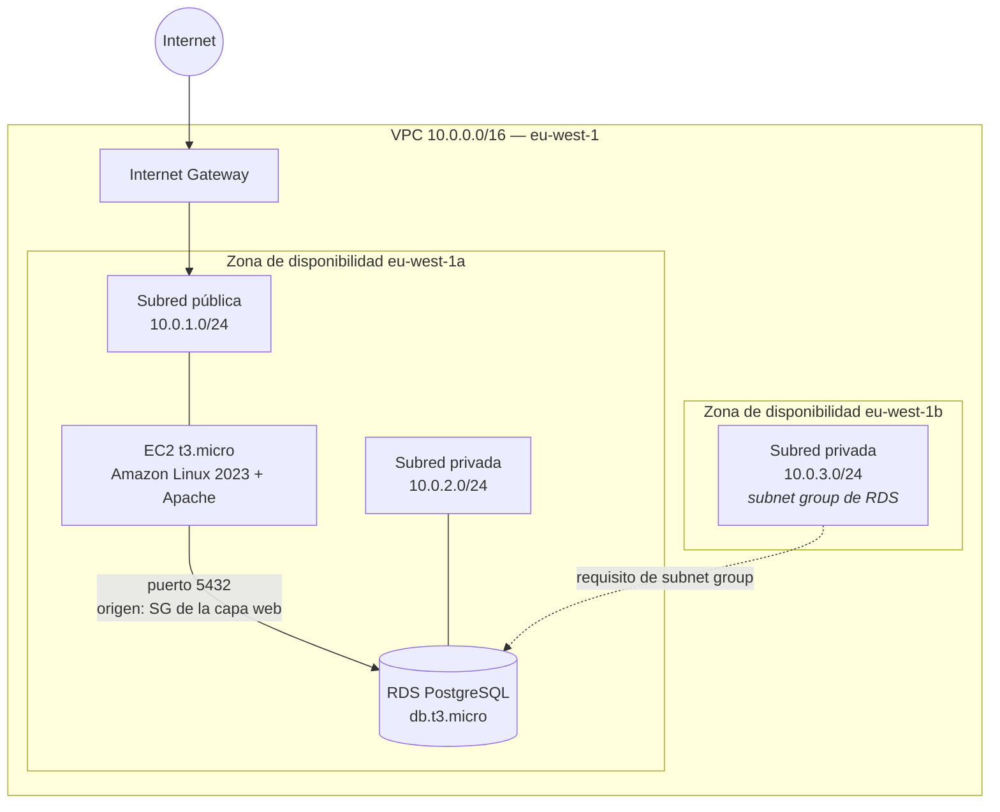

# Arquitectura Cloud en AWS — diseño, despliegue y auditoría posterior

Infraestructura web de tres capas sobre AWS (red, cómputo y datos), desplegada
en la región de Irlanda (`eu-west-1`) dentro de los límites de la capa gratuita.

Este repositorio documenta el proyecto final del CFGS de Administración de
Sistemas Informáticos en Red (calificado con Matrícula de Honor) **y la
auditoría que hice después sobre mi propio despliegue**, donde encontré tres
defectos de diseño que no había visto durante la ejecución.

La segunda parte es la que más me interesa de este repositorio. Documentar lo
que funciona es fácil; encontrar lo que no funciona en tu propio trabajo es el
ejercicio que separa configurar de diseñar.

---

## Índice

- [Arquitectura](#arquitectura)
- [Decisiones de diseño](#decisiones-de-diseño)
- [Qué se desplegó realmente](#qué-se-desplegó-realmente)
- [Auditoría posterior: tres defectos encontrados](#auditoría-posterior-tres-defectos-encontrados)
- [Incidente de costes: 21,96 USD](#incidente-de-costes-2196-usd)
- [Control de costes implantado](#control-de-costes-implantado)
- [Siguiente iteración: la misma arquitectura en Terraform](#siguiente-iteración-la-misma-arquitectura-en-terraform)
- [Estructura del repositorio](#estructura-del-repositorio)
- [Nota sobre metodología](#nota-sobre-metodología)

---

## Arquitectura



**Componentes desplegados**

| Capa | Recurso | Configuración |
|---|---|---|
| Red | VPC | `10.0.0.0/16` |
| Red | Subred pública | `10.0.1.0/24` — eu-west-1a |
| Red | Subred privada | `10.0.2.0/24` — eu-west-1a |
| Red | Subred privada auxiliar | `10.0.3.0/24` — eu-west-1b |
| Red | Internet Gateway + tabla de rutas pública | `0.0.0.0/0` → IGW |
| Cómputo | EC2 `t3.micro` | Amazon Linux 2023, Apache (`httpd`) con arranque persistente |
| Datos | RDS PostgreSQL `db.t3.micro` | Sin acceso público, capa gratuita |
| Seguridad | SG capa web | Entrada 80/TCP y 22/TCP |
| Seguridad | SG capa datos | Entrada 5432/TCP **con origen el SG de la capa web** |
| Observabilidad | Alarma de facturación CloudWatch + SNS | Umbral 1 USD |

---

## Decisiones de diseño

Cada decisión con su alternativa descartada y lo que costó elegirla.

### Bloque CIDR `/16` para la VPC

Proporciona 65.536 direcciones, muy por encima de lo que el proyecto necesita.
Un `/24` habría bastado.

**Por qué el `/16`:** el CIDR de una VPC no se puede reducir después de creada,
y el espacio de direcciones no se factura. El coste de sobredimensionar es cero;
el de quedarse corto es rehacer la red. En una red corporativa esta decisión
requiere además coordinarse con el direccionamiento on-premise para evitar
solapamientos en un futuro enlace VPN o Direct Connect.

### Encadenamiento de Security Groups en lugar de rangos IP

La regla de entrada del RDS no apunta a una dirección ni a un rango, sino al
**ID del Security Group de la capa web**.

**Qué gano:** cualquier instancia que se incorpore al grupo web —por ejemplo,
lanzada por un Auto Scaling Group— hereda el acceso a la base de datos sin tocar
ni una regla de firewall. El permiso se basa en pertenencia, no en topología.

**Qué pierdo:** ningún acceso directo a la base de datos desde fuera, ni siquiera
para mí como administrador. Para operar sobre ella hay que pasar por un host
intermedio. Es intencionado, pero tiene un coste operativo real que hay que
asumir conscientemente.

### Amazon Linux 2023 sobre Ubuntu

AMI mantenida por AWS, con el agente SSM y las herramientas de la plataforma
preinstaladas, y soporte a largo plazo. La contrapartida es menos comunidad y
menos paquetes de terceros que en Ubuntu.

### `t3.micro` y capa gratuita como restricción de diseño

El proyecto se diseñó con presupuesto cero como requisito explícito, no como
accidente. Esa restricción condiciona decisiones posteriores documentadas más
abajo: sin NAT Gateway y sin RDS Multi-AZ, dos servicios que quedan fuera de la
capa gratuita.

### Misma zona de disponibilidad para las subredes pública y privada

Ambas en `eu-west-1a`, lo que elimina el coste de transferencia de datos entre
zonas.

**Este es el trade-off más importante del proyecto, y lo resolví mal.** Ahorrar
en transferencia inter-AZ es un argumento de costes válido, pero es
incompatible con la alta disponibilidad: si esa zona cae, cae todo el sistema.
Ver la auditoría.

---

## Qué se desplegó realmente

Separo aquí, de forma explícita, la arquitectura de referencia del despliegue
real. La primera es el objetivo; la segunda es lo que estaba corriendo en la
cuenta.

| Elemento | Diseñado | Desplegado |
|---|---|---|
| Distribución en zonas | Multi-AZ | **Una sola zona** (`eu-west-1a`) para toda la carga |
| Balanceador de carga | ALB público delante de las instancias | Configurado, **pero no operativo** (ver auditoría) |
| Escalado | Auto Scaling Group, 1–3 instancias, umbral 60% CPU | Plantilla de lanzamiento y AMI creadas; sin tráfico real que validase el escalado |
| Base de datos | Multi-AZ con réplica | **Single-AZ**, capa gratuita |
| Salida a internet de la subred privada | NAT Gateway | **Pendiente de confirmar** — ver auditoría |
| Acceso administrativo | Restringido | SSH abierto a `0.0.0.0/0` |

Un subnet group de RDS con subredes en dos zonas es un **requisito de la API
para crear la instancia**, no una configuración de alta disponibilidad. La
instancia sigue viviendo en una sola zona hasta que se activa Multi-AZ
explícitamente. Es una confusión fácil de cometer y conviene dejarla dicha.

---

## Auditoría posterior: tres defectos encontrados

Al releer el proyecto con distancia encontré tres fallos. Los dejo documentados
porque el valor del repositorio está tanto en el diseño como en haberlos
detectado.

### 1. El Application Load Balancer no recibía tráfico de internet

El ALB se creó con esquema *internet-facing*, pero se mapeó a las subredes
**privadas** (`TFG-Subnet-Privada` en 1a y `TFG-Subnet-Privada-B` en 1b). La
consola de AWS emitió el aviso correspondiente en el momento de la creación:
esas subredes no tienen ruta hacia un Internet Gateway, por lo que el
balanceador no puede recibir peticiones externas.

**Por qué es un fallo:** un ALB público necesita sus interfaces en subredes con
ruta `0.0.0.0/0` hacia el IGW. El patrón correcto es el inverso al que
desplegué: **balanceador en las subredes públicas, instancias en las privadas**,
con el Security Group de las instancias aceptando tráfico únicamente desde el
Security Group del balanceador.

**Lección:** los avisos de la consola no son ruido. Ese aviso decía exactamente
lo que estaba pasando.

### 2. La alta disponibilidad estaba documentada, no desplegada

El proyecto afirma repetidamente que la arquitectura es de alta disponibilidad.
No lo era:

- Subred pública y privada, ambas en `eu-west-1a`.
- Instancia EC2 única, sin réplica en otra zona.
- RDS en capa gratuita, single-AZ.

**Por qué es un fallo:** un fallo de zona tumba el servicio completo, y la
recuperación del RDS dependería de restaurar una copia de seguridad —minutos u
horas de indisponibilidad, no conmutación automática.

**Lección:** la restricción de presupuesto era legítima; describir el resultado
como alta disponibilidad, no. Lo correcto es documentar la limitación y el
camino para levantarla, que es lo que hace este apartado.

### 3. Contradicción en la salida a internet de la subred privada

El documento original describe el despliegue de un NAT Gateway con Elastic IP y
una ruta `0.0.0.0/0` desde la tabla privada hacia él. La validación posterior,
en cambio, confirma que la subred privada quedó asociada a la tabla de rutas por
defecto, **sin ninguna ruta de salida**.

> **Pendiente de verificar en la cuenta:** ambas afirmaciones no pueden ser
> ciertas. Si el NAT Gateway llegó a crearse y permaneció activo, es un
> candidato principal al cargo descrito en el apartado siguiente, ya que factura
> por hora de existencia con independencia del tráfico que curse.

**Implicación operativa:** sin NAT, una instancia en subred privada no puede
ejecutar `dnf update` ni alcanzar ningún endpoint externo. Las alternativas,
por coste creciente:

| Opción | Coste | Cuándo aplica |
|---|---|---|
| VPC Endpoints (S3, SSM) | Gateway endpoints sin coste horario | Cuando solo se necesitan servicios concretos de AWS |
| NAT instance (EC2 propia) | Coste de una instancia pequeña | Laboratorios; no gestionado, es un punto único de fallo |
| NAT Gateway | Tarifa horaria + por GB procesado | Producción; gestionado y redundante dentro de la zona |

En un rediseño con presupuesto cero, los VPC Endpoints con SSM cubren la gestión
remota sin NAT y sin abrir el puerto 22 — lo que además resuelve el cuarto
problema.

### Apunte adicional: SSH abierto a internet

El Security Group de la capa web permite entrada por el puerto 22 desde
`0.0.0.0/0`, lo que contradice el principio de mínimo privilegio que el propio
proyecto defiende. Un puerto 22 expuesto recibe intentos de autenticación
automatizados de forma continua.

**Corrección:** restringir el origen a una IP concreta o, mejor, eliminar el
acceso SSH entrante y gestionar la instancia mediante **AWS Systems Manager
Session Manager**, que no requiere puertos abiertos, ni claves privadas en el
equipo local, ni IP pública, y deja traza auditable de cada sesión.

---

## Incidente de costes: 21,96 USD

Durante el desarrollo se registró un cargo inesperado de **21,96 USD** en la
región de Irlanda, con una tendencia al alza del 25,7 % respecto al periodo
anterior.

**Detección.** Revisión del panel de facturación, no una alerta. No había
ninguna configurada en ese momento: el gasto se descubrió mirando, no porque el
sistema avisara.

**Diagnóstico.** Recursos asociados al despliegue seguían generando coste
durante periodos de inactividad. La capa gratuita cubre un tipo de instancia y
un volumen de horas concretos, pero no el almacenamiento de snapshots que exceda
la cuota, ni servicios de red que facturan por existir.

**Acción correctiva.**

1. Detención de la instancia RDS.
2. Eliminación de snapshots redundantes fuera de cuota.
3. Implantación de una alarma de facturación con umbral de 1 USD.

**Lo que me llevo.** Lo relevante no son los 22 dólares. Es que el patrón escala:
un recurso olvidado en una región que nadie mira, multiplicado por el inventario
de una empresa mediana, es un problema presupuestario serio, y no lo detecta
nadie hasta que llega la factura. El control de costes no es una tarea
administrativa posterior al diseño — es parte del diseño. Cualquier
infraestructura que despliegue a partir de aquí nace con presupuesto y alarma
antes que con el primer recurso.

---

## Control de costes implantado

- **Alarma de facturación en CloudWatch** sobre la métrica `EstimatedCharges`,
  umbral estático de 1 USD.
- **Notificación vía Amazon SNS** por correo al superarse el umbral.
- Verificación de que la alarma entra en estado `ALARM` y la notificación llega.

Una alarma que nunca se ha probado no es una alarma. El envío se validó
explícitamente.

> **Nota de precios:** las tarifas de AWS varían por región y cambian con el
> tiempo. Cualquier cifra de coste de este documento debe contrastarse con la
> calculadora oficial antes de usarse como referencia.

---

## Siguiente iteración: la misma arquitectura en Terraform

Este despliegue se realizó íntegramente por consola. Es reproducible sólo a mano
y a base de leer la documentación, lo que en la práctica significa que no es
reproducible.

El siguiente paso es reescribirlo como infraestructura como código, corrigiendo
los tres defectos de la auditoría:

- [ ] Red base en Terraform: VPC, subredes públicas y privadas **en dos zonas
      reales**, IGW y tablas de rutas.
- [ ] ALB en las subredes públicas, instancias en las privadas, con el SG de las
      instancias aceptando tráfico únicamente desde el SG del balanceador.
- [ ] Acceso administrativo mediante SSM Session Manager; sin puerto 22 abierto.
- [ ] RDS en subred privada, conservando el encadenamiento de Security Groups.
- [ ] Presupuesto y alarma de facturación provisionados como código, desde el
      primer `apply`.
- [ ] Documentación del coste mensual estimado de cada opción.

El objetivo es que toda la infraestructura se levante y se destruya con un
comando, y que el coste sea cero mientras no esté levantada.

---

## Estructura del repositorio

```
.
├── README.md              Versión en inglés (documento principal)
├── README.es.md           Este documento
├── report.pdf             Memoria completa del proyecto
└── terraform/             (próximamente) la arquitectura corregida como código
```

---

## Nota sobre metodología

La documentación original se elaboró con asistencia de herramientas de IA para
redacción y contraste técnico. El diseño de la arquitectura, las decisiones de
dimensionamiento, el análisis de costes y la auditoría posterior son propios.

Las capturas incluidas en la memoria están sanitizadas: no contienen direcciones
IP públicas, identificadores de cuenta, nombres de claves, huellas de servidor ni
direcciones de correo. La infraestructura descrita fue destruida al finalizar el
proyecto, por lo que las direcciones privadas e identificadores de recursos que
siguen visibles no identifican nada.

---

**Eric González Rojas** — Madrid, España
[LinkedIn](https://linkedin.com/in/TU-PERFIL)
